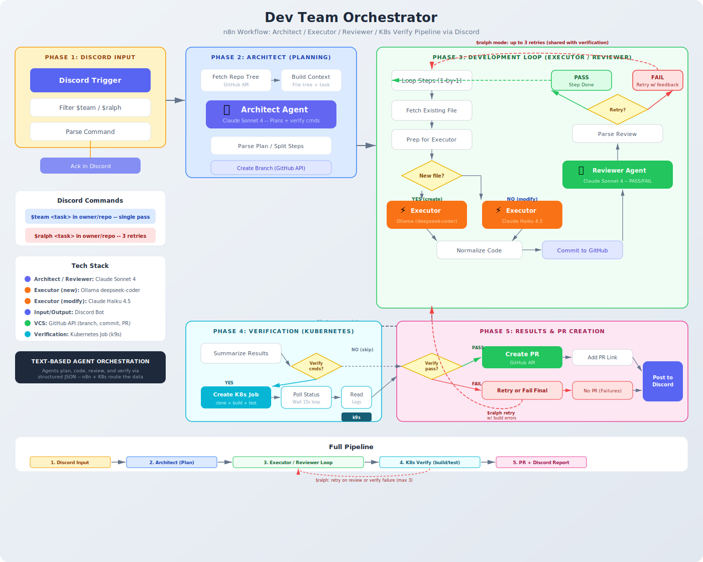
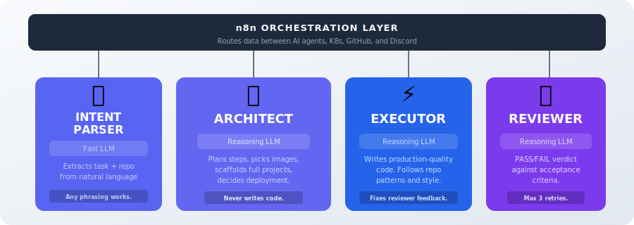
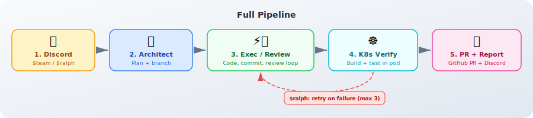

<div align="center">

# Dev Team Orchestrator

### AI agents that plan, write, review, verify, and deploy code — triggered from Discord.

<br>

[](#-agent-team)
[](#-pipeline-phases)
[](#-discord-commands)
[](k8s/)
[](#phase-5-deploy)

[](https://n8n.io)
[](LICENSE)
[](https://github.com/jonpol01/dev-team-orchestrator/pulls)

<br>



</div>

---

## What It Does

Type a message in Discord. AI agents plan the work, write the code, review it, build and test it in Kubernetes, deploy the server, and report back — all automatically.

```
$dev make a canvas page with a clock in jonpol01/test-repo
```

Minutes later: code committed, PR created, server running at `localhost:8080`.

---

## Quick Start

```bash
# 1. Clone
git clone https://github.com/jonpol01/dev-team-orchestrator.git
cd dev-team-orchestrator

# 2. Start n8n
docker compose -f ../n8n-docker-stack/docker-compose.yaml up -d

# 3. Import the workflow
#    n8n UI → Workflows → Import → workflows/dev-team-orchestrator.json

# 4. Set up Kubernetes
kubectl apply -f k8s/setup.yaml
docker build -t dev-team-runner:latest k8s/runner/

# 5. Trigger from Discord
$dev "add a health endpoint" in your-org/your-repo
```

---

## Discord Commands

| Command | Mode | Description |
|---------|------|-------------|
| `$dev <task> in owner/repo` | **One-shot** | Plan, code, review, verify, deploy. No retries. |
| `$auto <task> in owner/repo` | **Self-healing** | Same pipeline but retries up to 3x on failure. Feeds errors back to Executor. |

Natural language works — the AI intent parser extracts the task and repo from any phrasing:

```
$dev make a todo app with dark mode in jonpol01/test-repo
$auto fix the login bug in acme/webapp
$dev run tests in jonpol01/visionkit-feedback-server
```

---

## Agent Team



| Agent | Role | Key Behavior |
|-------|------|-------------|
| **Intent Parser** | Extracts task + repo from natural language | Any phrasing works. Fast LLM. |
| **Architect** | Plans steps, picks container images, decides deployment | Never writes code. Scaffolds full projects. |
| **Executor** | Writes production-quality code for each step | Follows repo patterns. Fixes reviewer feedback. |
| **Reviewer** | PASS/FAIL verdict against acceptance criteria | Strict on criteria. Max 3 retries in $auto mode. |

All agents use a **pluggable LLM backend** — swap models without changing the pipeline.

---

## Pipeline Phases



### Phase 1: Discord Input
- Discord webhook triggers the pipeline
- AI Intent Parser (LLM) extracts task and repo from natural language
- Sends acknowledgment with parsed details

### Phase 2: Analysis + Architect
- **Codebase Analysis** (K8s Job) — detects language, framework, dependencies, docker-compose
- **Architect Agent** — produces a JSON plan with steps, container image, and deployment config
- Smart scaffolding: web content gets a Dockerfile + docker-compose.yml automatically
- Creates a feature branch on GitHub

### Phase 3: Executor + Reviewer Loop
- For each step in the plan:
  - **Executor** writes the code
  - **Commits** to the feature branch via GitHub API
  - **Reviewer** checks against acceptance criteria
  - On `FAIL` in `$auto` mode: feeds feedback back to Executor (up to 3 retries)

### Phase 4: K8s Verification
- Spins up a **Docker-in-Docker K8s Job** that:
  - Clones the branch
  - Runs `docker compose build` (for full-stack projects)
  - Health checks the running server
- Supports both simple (single container) and full-stack (DinD) modes
- Architect picks the right container image based on the codebase

### Phase 5: Deploy
- If the Architect determined the project is a web server:
  - Creates a **K8s LoadBalancer Service** pointing at the verify pod
  - Server accessible at `localhost:port`
  - Reports the URL to Discord
- CLI tools and libraries skip deployment

### Phase 6: PR + Report
- Creates a GitHub Pull Request (if code was changed)
- Posts final summary to Discord: status, URL, PR link
- Verification-only runs report "no code changes needed"

---

## Project Structure

```
dev-team-orchestrator/
├── architecture.svg                   # Visual pipeline diagram
├── assets/
│   ├── agent-team.svg                 # Agent team diagram
│   └── pipeline.svg                   # Pipeline phase diagram
│
├── workflows/
│   └── dev-team-orchestrator.json     # n8n workflow (import this)
│
├── k8s/
│   ├── setup.yaml                     # Namespace, RBAC, ServiceAccount
│   ├── README.md                      # K8s setup guide
│   └── runner/
│       └── Dockerfile                 # Multi-lang build environment
│
├── discord-bot/
│   ├── bot.py                         # Discord bot (webhook relay)
│   ├── Dockerfile
│   └── docker-compose.yaml
│
└── docker-compose.override.yaml       # Ollama + env config
```

---

## Setup Guide

### Prerequisites

| Tool | Purpose |
|------|---------|
| [Docker Desktop](https://www.docker.com/products/docker-desktop/) | Run n8n, K8s, and containers |
| [n8n](https://n8n.io) | Workflow orchestration |
| [kubectl](https://kubernetes.io/docs/tasks/tools/) | Kubernetes CLI |

### n8n Credentials

Set up these credentials in n8n:

| Credential | Used By |
|------------|---------|
| Discord Bot API | Webhook trigger, Discord messages |
| GitHub API | Fetch files, commit, create branch/PR |
| LLM API (xAI, OpenAI, etc.) | All AI agents |

### Kubernetes Setup

```bash
kubectl apply -f k8s/setup.yaml
docker build -t dev-team-runner:latest k8s/runner/
```

For Docker Desktop K8s, load container images into Kind nodes:
```bash
docker save rust:1.88-slim | docker exec -i desktop-worker ctr -n k8s.io images import -
docker save node:22-slim | docker exec -i desktop-worker ctr -n k8s.io images import -
docker save docker:dind | docker exec -i desktop-worker ctr -n k8s.io images import -
```

See [k8s/README.md](k8s/README.md) for the full guide.

---

## Safety

- **Dual verification** — AI code review + K8s build/test
- **Smart retries** — `$auto` feeds specific errors back, not blind retries
- **Docker-in-Docker isolation** — builds run in ephemeral K8s pods
- **Auto-cleanup** — K8s Jobs garbage-collected after 1-2 hours
- **Minimal RBAC** — service account limited to Jobs, Deployments, Services, and pod logs

---

## Tech Stack

| Layer | Technology |
|-------|-----------|
| **Orchestration** | n8n workflow engine |
| **AI Agents** | Pluggable LLM (xAI Grok, OpenAI, Ollama, etc.) |
| **Build/Test** | Kubernetes Jobs with Docker-in-Docker |
| **Deployment** | K8s LoadBalancer Service on localhost |
| **VCS** | GitHub API (branches, commits, PRs) |
| **Communication** | Discord Bot |

---

## Contributing

PRs welcome. To add new agents, LLM backends, or verification strategies:

1. Fork the repo
2. Create a feature branch
3. Submit a PR

---

## License

MIT License — see [LICENSE](LICENSE) for details.
